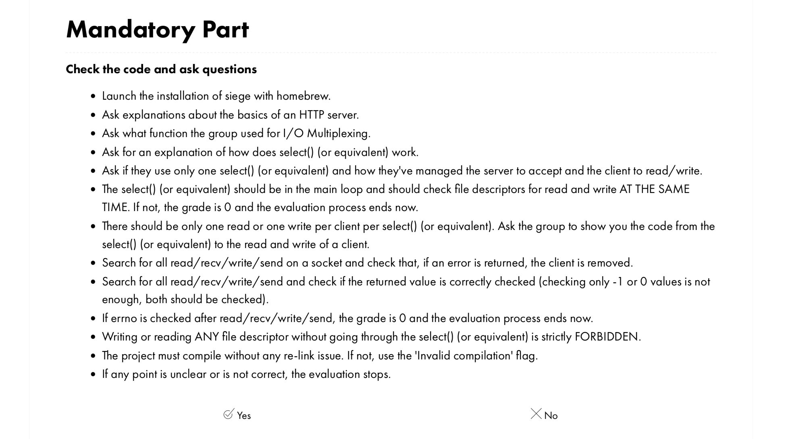
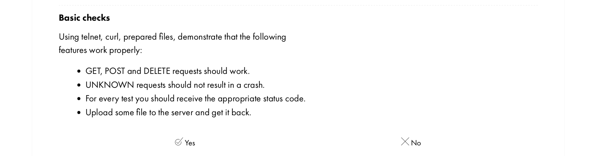
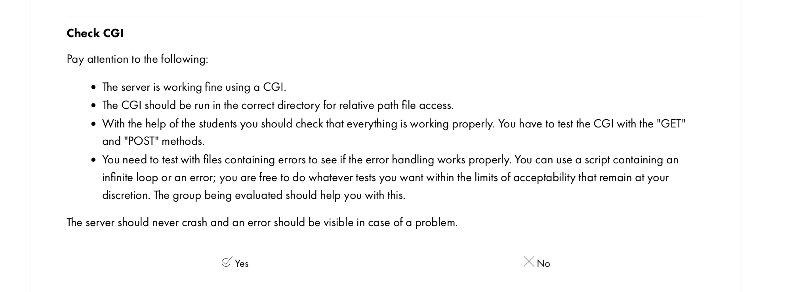
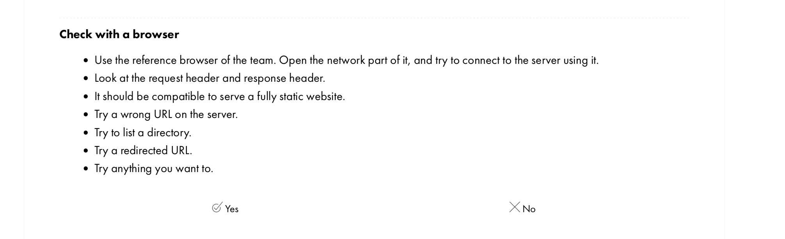
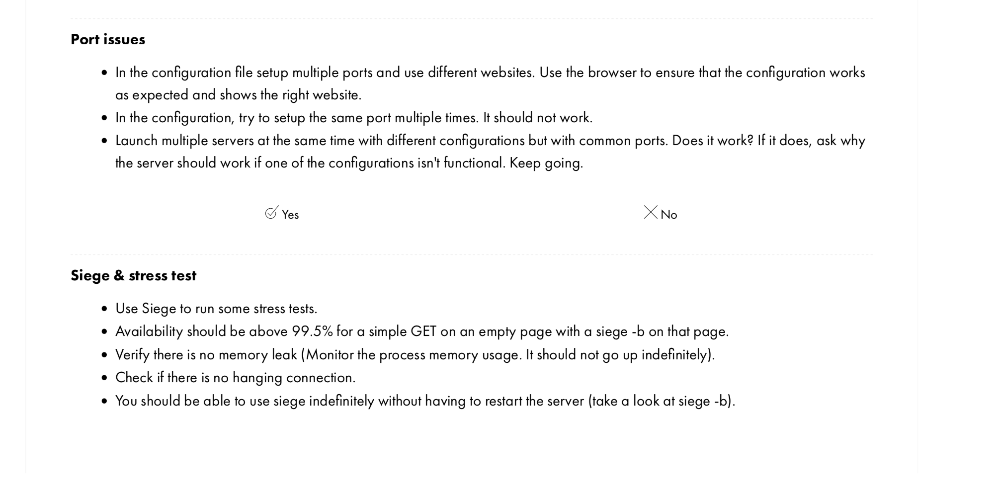
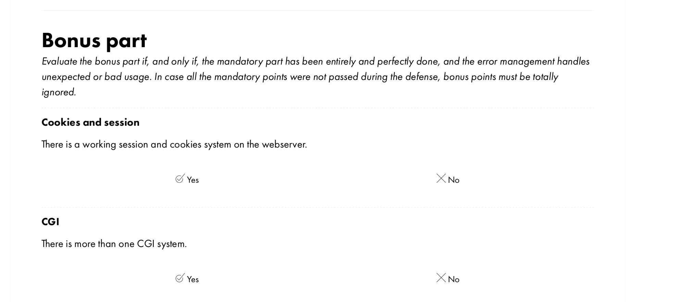

### Webserv :

---


---

This project is about writing a [HTTP server](https://en.wikipedia.org/wiki/Web_server), your own version of [Nginx](https://www.nginx.com/), [Apache](https://apache.org/) or [Lighttpd](https://www.lighttpd.net/).

### What is Webserv ?

Webserv is a group project at 1337 which requires us to build a [HTTP server](https://en.wikipedia.org/wiki/Web_server) using [I/O Multiplexing](https://notes.shichao.io/unp/ch6/) built on top of a [event loop](https://en.wikipedia.org/wiki/Event_loop#:~:text=In%20computer%20science%2C%20the%20event,or%20messages%20in%20a%20program.).

In the mandatory part, we start the server by reading a [configuration file](https://docs.nginx.com/nginx/admin-guide/basic-functionality/managing-configuration-files/) that can be based on [Nginx](https://www.nginx.com/), containing information like hostname(ip/port), servername, index file, directory listing, URL redirect, location(vhost path) and some other settings. It is forbidden to use [fork](https://man7.org/linux/man-pages/man2/fork.2.html) to create new [non-CGI](https://en.wikipedia.org/wiki/Common_Gateway_Interface) processes or spawn [threads](https://en.wikipedia.org/wiki/Thread_(computing)) (threads are not available in [C++98](https://cplusplus.com/reference/)).

---


---

### Ressources ###

- [Configuration file structure](https://www.youtube.com/watch?v=3YkSpaqcDz8&ab_channel=JayDesai)

- [Perfect guide](https://earthy-mandarin-bcd.notion.site/Webserv-8e45bd5fd3ab42889566c11cfe18a89c)

- [Article about HTTP Server in C](https://medium.com/from-the-scratch/http-server-what-do-you-need-to-know-to-build-a-simple-http-server-from-scratch-d1ef8945e4fa)

---

- [Playlist](https://www.youtube.com/watch?v=Kc1kwm1WyVM&list=PLPUbh_UILtZW1spXkwszDBN9YhtB0tFKC&ab_channel=SloanKelly)

---

### General instructions ##

* Your program must not crash under any circumstances (even if it runs out of memory) and must not terminate unexpectedly. If this happens, your project will be considered non-functional and your score will be 0.
* You must include a Makefile that will compile your source files. It should not re-link.
* Your Makefile must at least contain the rules:
	> `$(NAME), all, clean, fclean and re`
* Compile your code with c++ and the flags -Wall -Wextra -Werror
* Your code must comply with the C++ 98 standard. Then, it should still compile
if you add the flag -std=c++98.
* Try to always develop using as many C++ features as possible (for example, choose <cstring> over <string.h>). You are allowed to use C functions, but always prefer their C++ versions if possible.
* Any external library and Boost libraries are prohibited


</details>

 <details>
 			<summury> Mandatory part  </summury>


| Program name | web server |
| :-------------------------: | :--------------------------------------------------------------------------------------------------------------------------------------------------------------------------------------------------------------------------------- |
| Files for donation | Makefile, *.{h, hpp}, *.cpp, *.tpp, *.ipp, configuration files |
|          Makefile           | NAME, all, clean, fclean, re                                                                                                                                                                                                       |
| Options | [A configuration file] |
| Allowed external functions | Everything in C++ 98 , getsockname, fcntl |
| Using libft | n/a |
| Description | A HTTP server in C++ 98 |

You must write a HTTP server in C++ 98.

Your executable will be run as follows:
	 ./webserv [configuration file]

> Even if the subject and rating scale mention poll(), you can use any equivalent such as select(), kqueue(), or epoll().

> Please read the RFC and run some tests with telnet and NGINX before starting this project. Even if you don't need to implement every RFC, reading it will help you develop the features you need.


### Subject && Requirements ###

* Your program must accept a configuration file as an argument, or use the default path.
* You cannot `execve` another web server
* Your server should never block and the client can be properly returned if needed.
* It must be non-blocking and use only `1 poll()` (or equivalent) for all I/O operations between client and server (including listening).
* `poll()` (or similar) should check for read and write at the same time.
* You should never perform a read or write operation without going through `poll()` (or similar).
* Checking the value of `errno` is strictly prohibited after a read or write operation.
* You don't need to use `poll()` (or equivalent) before reading the config file.
> Because you have to use non-blocking file descriptors, you can use the read/get or write/send functions without `poll()` (or equivalent) and your server won't block. But it will consume more system resources. Thus, if you try to read/get or write/send any file descriptor without using poll() (or similar), your score will be 0.
* You can use any macro and define as `FD_SET, FD_CLR, FD_ISSET, FD_ZERO` (understanding what and how they do is very helpful).
* A request to your server should never hang forever.
* Your server must be compatible with the `web browser` of your choice.
* We will assume that `NGINX` is compatible with `HTTP 1.1` and can be used to compare headers and behavior of responses.
* Your HTTP response status codes must be accurate.
* Your server should have `default error pages` if not provided.
* You cannot use fork for anything other than CGI (like PHP or Python, etc.).
* You must be able to maintain a completely static website.
* Clients must be able to upload files.
* You need at least the `GET, POST and DELETE` methods.
* Stress tests of your server. It must be available at any cost.
* Your server must be able to listen on multiple ports (see configuration file).

### For MacOS only ###

> Since MacOS does not implement write() in the same way as other Unix OSes, you are allowed to use fcntl().
You must use file descriptors in non-blocking mode to get behavior similar to other Unix operating systems.

> However, you are only allowed to use fcntl() like this:
fcntl(fd, F_SETFL, O_NONBLOCK);
Any other flags are prohibited.

### Configuration file ###

> You can get some inspiration from the "server" part of the NGINX configuration file.

In the config file you should be able to:
* Select the port and host of each `server`.
* Set `server_names` or not.
* The first server for `host:port` will be the default for that `host:port` (meaning it will respond to all requests that do not belong to another server).
* Customize default error pages.
* Limit `body size` client.
* Set up routes with one or more of the following rules/configurations (routes will not use regex):
	* Define a list of valid HTTP methods for the route.
	* Define `HTTP` redirect
	* Specify the directory or file in which to look for the file (for example, if the URL `/kapouet` is linked to `/tmp/www`, the URL `/kapouet/pouic/toto/pouet` is `/tmp/ www/pouic/toto/pouet`).
	* Turn the directory listing on or off.
	* Execute CGI based on a specific file extension (eg .php).
	* Make it possible for the route to accept downloaded files, and configure where they are saved.
		* Are you wondering what is [CGI](https://en.wikipedia.org/wiki/Common_Gateway_Interface)?
		* Since you won't be calling `CGI` directly, use the full path as `PATH_INFO`.
		* Just remember that for a fragmented request, your server must unblock it, and `CGI` will expect `EOF` as the end of `body`.
		* Same for `CGI` output. If no `content_length` is returned from CGI, `EOF` marks the end of the returned data.
		* Your program must call `CGI` with the requested file as the first argument.
		* `CGI` must run in the correct directory to access relative path files.
		* Your server must work with one `CGI` (php-CGI, Python, etc.).

You must provide some configuration files and default base files for testing and demonstrating how each feature works during evaluation.

> If you have a question about one behavior, you should compare your program's behavior with that of NGINX.
For example, check how server_name works.
We have shared with you a small tester. It is not necessary to go through it if everything works fine with your browser and tests, but it can help you find some errors.

> The main thing is sustainability. Your server should never die.

> Don't test with just one program. Write tests in a more convenient language like Python or Golang etc. Even in C or C++ if you want.

### Bonus part ##

Here are additional features you can add:
* Support for `cookies` and `session_management` files (prepare short examples).
* Handling multiple `CGI`.

> The bonus part will only be evaluated if the required part is "EXCELLENT". Perfect means that the required part has been fully completed and is running smoothly. If you have not met ALL of the mandatory requirements, your bonus portion will not be evaluated at all.
</details>

---

### :repeat: Parsing Logic : DOCUMENTATION !

---

* Author : ablaamim

> Parsing configuration file :

## Specifications restricted by the subject :

In the configuration file, you should be able to:

• Choose the port and host of each ’server’.

• Setup the server_names or not.

• The first server for a host:port will be the default for this host:port (that means

it will answer to all the requests that don’t belong to an other server).

• Setup default error pages.

• Limit client body size.

• Setup routes with one or multiple of the following rules/configuration (routes wont

be using regexp):

◦ Define a list of accepted HTTP methods for the route.

◦ Define a HTTP redirection.

◦ Define a directory or a file from where the file should be searched (for example,

if url /kapouet is rooted to /tmp/www, url /kapouet/pouic/toto/pouet is
/tmp/www/pouic/toto/pouet).

◦ Turn on or off directory listing.

◦ Set a default file to answer if the request is a directory.

◦ Execute CGI based on certain file extension (for example .php).

◦ Make it work with POST and GET methods.

◦ Make the route able to accept uploaded files and configure where they should
be saved.

---

### Configuration file, Nginx like config :

---

Configuration file is a text file that contains various settings and directives that dictate how the web server should operate. These settings can include things like the port number that the web server should listen on, the location of the web server's root directory, and many other settings.

Here is an example fie that shows config file format and supported directives.
<br>
```nginx

server 
{
    listen 127.0.0.1 8001;              # listening ip/port
    error_pages 404 /error/404.html;    # default error page
    max_body_size 1024;                 # max request body size in bytes
    index index.html index2.html;       # default page when requesting a directory, index.html by default

    location /
    {                   
        root Webserver/www/html;        # root folder of site directory, full or relative path
        auto_index on;                  # turn on/off directory listing
        allowed_methods POST GET;       # allowed methods in location, only get is set by default
        index index.html;               # default page when requesting a directory, copies root index by default
        return abc/index1.html;         # redirection
    }

    location /
    {
        bin-cgi .py /usr/bin/python3;   # location of interpreters installed on the current system, mandatory parameter and extensions for executable files, mandatory parameter
    }
}
```
---

#### :wrench: Testing :wrench: :

---


---

| TEST TO RUN  | PART |  ERROR TYPE | CONFIG TO TEST WITH / Command | AUTHOR | STATUS |
|--- |--- |--- |--- | ---|--- |
| Makefile | Program | No relink | Makefile in root | Team | :white_check_mark: |
| Take a configuration file as argument or use default path | Program | Should run with or without configuration file | None | Abdessamad | :white_check_mark: |
| Siege & stress test | Multiplexing | Siege Result is 100% Also server never hangs (Always Available) | siege -b localhost:8080 | Zineb | :white_check_mark: |
| You should be able to use siege indefinitely without having to restart the server (take a look at siege -b) | Multiplexing | Working | siege -b localhost:8080 | Zineb | :white_check_mark: |
| Multiple Listen inside same server-context | Parsing | each server could bind more than one socket | [config_file](./TESTING/conf02.conf) | Abdessamad | :white_check_mark: |
| No index and no auto_index provided in conf | Response | Segmentation fault | [config_file](./TESTING/conf00.conf) |  Achraf | :white_check_mark:  |
| No root in location context | Parsing | Unapropriate behavior | [config_file](./TESTING/conf01.conf) | Abdessamaad | :white_check_mark: |
| Protection of all system calls | The whole program | Exceptions must be thrown | None needed | Team | :white_check_mark: |
| HTTP Response Code 413 (Content too large) | Request check | Error code not accurate | POSTMAN + [config_file](./TESTING/conf03.conf) | Zineb | :x: |
| HTTP Response Code 411 (Content length required) | Request check | Error code not accurate  | POSTMAN + [config_file](./TESTING/conf03.conf) | Zineb | :x: |
| HTTP Response Code 400 (Bad Request) | Request check | Error code not accurate | POSTMAN + [config_file](./TESTING/conf03.conf) | Zineb | :x: |
| HTTP Response Code 501 (Not implemented) for Transfert encoding not chuncked | Request check | Error code not accurate | [config_file](./TESTING/conf03.conf) | Zineb | :x: |
| Setup multiple Servers with different ports | Socket creation and Parsing | Working | [config_file](./TESTING/conf04.conf) | Abdessamad | :white_check_mark: |
| Setup multiple servers with different hostnames/server_names | Program | Working | [config_file](./TESTING/conf05.conf) + curl http://www.example.com --resolve www.example.com:8080:127.0.0.1 | team | :white_check_mark: |
| Limit the client body | - | i didnt understand the test from the correction page | (use: curl -X POST -H "Content-Type: plain/text" --data "BODY IS HERE write something shorter or longer than body limit") | - | :x: |
| Setup routes in a server to different directories | Parsing/Response  | Working | [config_file](./TESTING/conf07.conf) | Abdessamad/Achraf | :white_check_mark: |
| Setup a list of methods accepted for a certain route [GET] | Response | Get method on a video doesnt render it | [config_file](./TESTING/conf08.conf) | Achraf | :white_check_mark: |
| Try to list a directory | Response | Working | [config_file](./TESTING/conf09.conf) | Abdessamad | :white_check_mark: |
| Setup multiple Servers with same configuration, the first server must be the default to select | Parsing/Response | Working | [config_file](./TESTING/conf10.conf) | Achraf/Abdessamad | :white_check_mark: |
| Verify there is no memory leak (Monitor the process memory usage. It should not go up indefinitely) | Program | - | [leaks.sh](./leaks.sh) + [config_file](./TESTING/conf00.conf) | Team | - |
| Set one server_name per server, stop the program otherwise | Parsing | Need to throw an exception | [config_file](./TESTING/conf09.conf) | Abdessamad | :white_check_mark: |
| UNKNOWN requests should not result in a crash | Check request | Accurate error code | POSTMAN + [config_file](./TESTING/conf10.conf) | Abdessamad | :white_check_mark: |

---

#### Correction Page :

---



---

> Skip ask question part, only code check section is checked.

| TEST TO RUN  | PART |  ERROR TYPE | CONFIG TO TEST WITH / Command | AUTHOR | STATUS |
|--- |--- |--- |--- | ---|--- |
| The select() (or equivalent) should be in the main loop and should check file descriptors for read and write AT THE SAME
TIME| Multiplexing | - | - | Zineb  | :white_check_mark: | 
| There should be only one read or one write per client per select() (or equivalent). Ask the group to show you the code from the
select() (or equivalent) to the read and write of a client| Program | - |  - |Team | :white_check_mark: |
| Search for all read/recv/write/send and check if the returned value is correctly checked (checking only -1 or 0 values is not
enough, both should be checked) | Program | - | - | Team | :white_check_mark: |
| If errno is checked after read/recv/write/send, the grade is 0 and the evaluation process ends now | Program | - | - | Team | :white_check_mark: |
| Writing or reading ANY file descriptor without going through the select() (or equivalent) is strictly FORBIDDEN. | Multiplexing | - | - | Zineb | :white_check_mark: |
| The project must compile without any re-link issue. If not, use the 'Invalid compilation' flag | Program | - | - | Team | :white_check_mark: | 

---


---

| TEST TO RUN  | PART |  ERROR TYPE | CONFIG TO TEST WITH / Command | AUTHOR | STATUS |
|--- |--- |--- |--- | ---|--- |

---



---

| TEST TO RUN  | PART |  ERROR TYPE | CONFIG TO TEST WITH / Command | AUTHOR | STATUS |
|--- |--- |--- |--- | ---|--- |

---



---

| TEST TO RUN  | PART |  ERROR TYPE | CONFIG TO TEST WITH / Command | AUTHOR | STATUS |
|--- |--- |--- |--- | ---|--- |

---



---

| TEST TO RUN  | PART |  ERROR TYPE | CONFIG TO TEST WITH / Command | AUTHOR | STATUS |
|--- |--- |--- |--- | ---|--- |


---



---

| TEST TO RUN  | PART |  ERROR TYPE | CONFIG TO TEST WITH / Command | AUTHOR | STATUS |
|--- |--- |--- |--- | ---|--- |

---



---

| TEST TO RUN  | PART |  ERROR TYPE | CONFIG TO TEST WITH / Command | AUTHOR | STATUS |
|--- |--- |--- |--- | ---|--- |

---